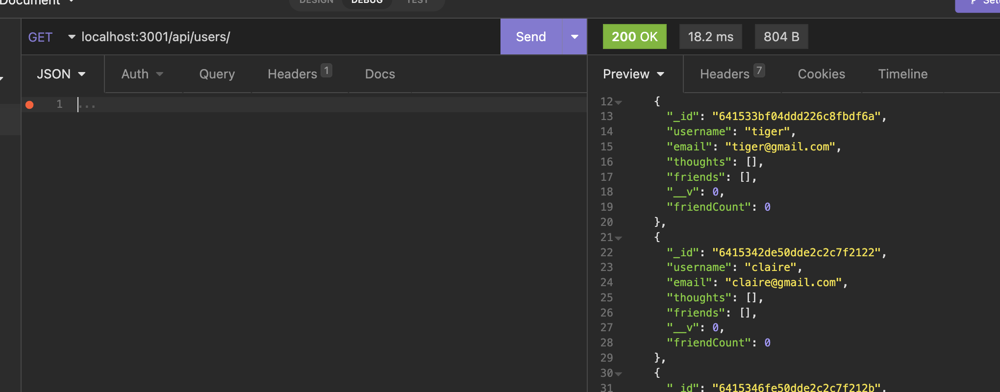

# social-media-api

Description: This is a back end application that functions as a social media API. Through Insomnia, users can create, edit, and delete users, add friends and delete friends, create, edit, and delete posts, and add reactions to posts. This app functions with Mongoose as the database.

Installation: N/A

Usage: Please visit this link to view a walkthrough of the project

Credits N/A

License Please refer to the license in the repo

